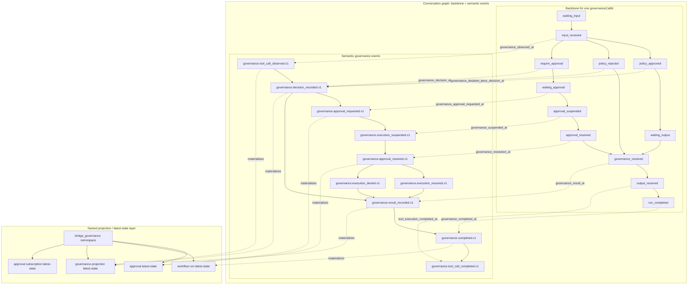

# ARD: Persistence Model For The OpenClaw × Kogwistar Governance Seam

This document describes the current persistence model and the remaining
refinement areas for the OpenClaw × Kogwistar bridge.

It no longer describes a planned cutover from an in-memory bridge seam. That
cutover has already happened.

Related implementation note:

- [governance-semantics-traps.md](/home/azureuser/cloistar/governance-semantics-traps.md)
  captures the concrete semantic traps and live failure modes we hit while
  wiring the governance graph, approval linkage, and CDC path.

## Goal

Keep governance state durable enough that:

- bridge restart does not erase operator-facing truth
- approval and workflow state can be rebuilt from durable records
- semantic governance lineage remains visible in the graph
- `/debug/state` is materialized from durable state rather than process memory

## Current Model

The bridge now uses a durable graph-plus-projection model.

### Durable sources of truth

- Kogwistar workflow graph state
- Kogwistar conversation graph state
- bridge latest-state records materialized through the named-projection/meta
  layer

The bridge no longer depends on a process-local in-memory store as the primary
source of truth.

### Bridge persistence layers

The current bridge persists:

- canonical governance events
- integration receipts
- approval records
- gateway approval records
- workflow run records
- governance latest-state projection rows
- approval subscription status

These are managed through:

- [bridge/app/store.py](/home/azureuser/cloistar/bridge/app/store.py)
- [bridge/app/runtime/governance_service.py](/home/azureuser/cloistar/bridge/app/runtime/governance_service.py)

### Graph semantics

The conversation graph carries semantic governance lineage, including:

- observed proposal
- decision
- approval request
- execution suspended
- approval resolved
- execution resumed or denied
- governance result recorded
- governance completed
- tool call completed when actual execution finishes

Backbone steps are written separately from side-event semantics so the graph can
show both:

- one canonical backbone per governed tool call
- semantic event nodes and edges attached to that backbone

### Latest-state projection model

Operator/debug latest state is rebuilt from durable records through the generic
named-projection substrate, not from Python process memory.

The bridge projection namespace is:

- `bridge_governance`

This latest-state layer is intentionally separate from the semantic conversation
graph:

- graph holds lineage and semantics
- named projection holds current operator/debug view

That separation is important. Projection correctness does not by itself prove
graph correctness.

## What Is Implemented

### Durable operator/debug state

`/debug/state` now reflects durable records and projections rather than an
ephemeral in-memory dict.

That includes:

- approvals
- gateway approvals
- workflow runs
- governance projection
- approval subscription status
- canonical events
- receipts

### Durable approval suspend/resume support

Governance suspend/resume now depends on persisted workflow state and durable
bridge-side approval linkage, not just request-local memory.

### Common result and terminal completion semantics

Every governance branch now has explicit semantic end markers:

- `governance.result_recorded.v1`
- `governance.completed.v1`

This ensures:

- allow path has a clear result
- block path has a clear result
- approval allow path has a clear result
- approval deny path has a clear result

`governance.tool_call_completed.v1` remains execution-specific rather than the
universal completion marker.

## Clarifications

### Not “fully graph-only”

The bridge is graph-native in semantics, but it is not graph-query-only in its
operator surface.

That is intentional.

The design is:

- semantic graph for lineage
- named projection for latest-state

The operator-facing latest-state view does not need to be reconstructed by
ad hoc graph traversal alone.

### Kogwistar substrate dependency

Kogwistar is the current substrate for:

- workflow runtime
- conversation graph
- durable meta/named projections

Some runtime trace details therefore follow current Kogwistar runtime behavior,
especially around suspend/resume execution trace continuity. That is a substrate
detail, not a sign that the bridge persistence model is still hybrid or
unfinished.

## Main Persistence Entities

The current durable governance model covers at least:

- proposal observed
- decision recorded
- approval requested
- approval resolved
- execution suspended
- execution resumed
- execution denied
- governance result recorded
- governance completed
- tool call completed

Important linkage keys include:

- `governanceCallId`
- `approvalRequestId`
- `gatewayApprovalId` when present
- `toolCallId`
- workflow run id
- projection node ids

## Backbone Model

The governance graph follows a backbone-first model.

The backbone is the canonical execution chain for one governed tool call.
Semantic events attach to that chain rather than replacing it.

Illustrative patterns:

Allow path:

- waiting_input
- input_received
- policy_approved
- waiting_output
- governance_resolved
- output_received
- run_completed

Block path:

- waiting_input
- input_received
- policy_rejected
- governance_resolved
- run_completed

Require-approval path:

- waiting_input
- input_received
- require_approval
- waiting_approval
- approval_suspended
- approval_received
- governance_resolved
- run_completed

The exact labels may continue to evolve, but the model should keep:

- one backbone per governed tool call
- semantic side events attached to the relevant backbone step
- no projection/status rows polluting the semantic graph

## Mermaid Reference Shape

## Projection / Graph Separation Rules

These rules are now part of the intended design:

- latest-state projection rows live in named projection/meta
- semantic governance lineage lives in the conversation graph
- operational status rows such as approval-subscription state should not be
  persisted as standalone semantic conversation nodes

## Future Refinement Areas

The remaining work is not “replace hybrid persistence.”

The remaining work is mainly:

- better operator/query ergonomics over the existing durable model
- clearer CDC and inspection surfaces
- continued cleanup of graph shape and runtime trace continuity
- possible higher-level session linking across multiple governed tool calls

### Future update: multi-turn session linking

Today the cleanest governance shape is still:

- one governance backbone per governed tool call
- one scoped append-only lineage per `governanceCallId`

Longer term, the graph should also support:

- links between governed tool-call backbones that belong to the same
  OpenClaw session or run family

Important constraint:

- do not collapse multiple governed tool calls into one single backbone chain
- instead, preserve one backbone per governed tool call and add higher-level
  links between them

## Source Files

- Bridge entrypoint:
  - [bridge/app/main.py](/home/azureuser/cloistar/bridge/app/main.py)
- Bridge store:
  - [bridge/app/store.py](/home/azureuser/cloistar/bridge/app/store.py)
- Governance service:
  - [bridge/app/runtime/governance_service.py](/home/azureuser/cloistar/bridge/app/runtime/governance_service.py)
- Governance runtime:
  - [bridge/app/runtime/governance_runtime.py](/home/azureuser/cloistar/bridge/app/runtime/governance_runtime.py)
- Governance workflow design:
  - [bridge/app/runtime/governance_design.py](/home/azureuser/cloistar/bridge/app/runtime/governance_design.py)
- Governance resolvers:
  - [bridge/app/runtime/governance_resolvers.py](/home/azureuser/cloistar/bridge/app/runtime/governance_resolvers.py)
