# ARD: Persistence Roadmap For The OpenClaw × Kogwistar Governance Seam

This document captures the next architecture step after the current bridge/runtime seam stabilization work: moving from a mostly in-memory bridge read model to a persistent governance state model that survives bridge restarts and supports replay, audit, and operator recovery.

Related implementation note:

- [governance-semantics-traps.md](/home/azureuser/cloistar/governance-semantics-traps.md) captures the concrete semantic traps and live failure modes we hit while wiring the governance graph, approval linkage, and CDC path.

## Goal

Make governance state durable enough that a bridge restart does not erase the operator-facing truth.

That means:

- governance proposals, decisions, approvals, and completions persist beyond process lifetime
- workflow suspend/resume remains recoverable after bridge restart
- `/debug/state` or its replacement can be rebuilt from durable state rather than only Python memory
- the bridge stops depending on `InMemoryStore` as the primary source of truth

## Current State

Today the system is still hybrid, but the first durable cutover has landed.

### Already persistent

- The bridge-hosted Kogwistar runtime uses `GraphKnowledgeEngine` with `persist_directory` for:
  - workflow graph state
  - conversation graph state
- That persistence is stable if `KOGWISTAR_RUNTIME_DATA_DIR` is set
- Workflow suspension and resume already rely on Kogwistar runtime persistence semantics
- The bridge now has a `GovernanceService` facade that persists operator-facing
  row state under the runtime root, so:
  - `events`
  - `approvals`
  - `gatewayApprovals`
  - `workflowRuns`
  - `governanceProjection`
  - `approvalSubscription`
  - `receipts`
  survive bridge-host restart
- `/debug/state` is now materialized from that durable store facade rather than
  from a process-local Python dict

### Still not fully graph-native

- The durable store facade is authoritative, but its row persistence is
  currently filesystem JSON under the runtime root, not yet fully rebuilt from
  querying persisted conversation/workflow graph artifacts alone
- Backbone and governance lineage nodes are still written into the Kogwistar
  conversation graph, but the row-oriented operator/debug view is not yet
  recovered from those graph nodes directly
- So the bridge has removed `InMemoryStore` as the source of truth, but has not
  finished the deeper graph-native read-model phase

### Important backend clarification

The earlier draft overstated `persist_directory` as if it were the universal
persistence knob. That is not accurate for every Kogwistar backend.

- `persist_directory` is relevant for the local SQL-meta plus Chroma-style path
- for in-memory or pgvector-backed paths, that directory may be unused or only
  partially relevant
- in this repo environment, reopening a fresh `GraphKnowledgeEngine` on the
  same `persist_directory` did not restore conversation nodes reliably enough to
  use graph rows alone as the durable operator store

So this ARD should talk about durable runtime/graph persistence at the engine
and backend level, not pretend that one filesystem directory alone defines all
persistence behavior.

## Problem Statement

The current seam is good enough for dev-loop validation, but not good enough for durable operator workflows.

Important failures today:

- bridge restart loses pending approval rows even if workflow runtime artifacts still exist on disk
- operator-facing debug state is not rebuilt from persisted Kogwistar state
- the bridge currently maintains two truths:
  - persisted runtime/graph lineage
  - ephemeral in-memory canonical event/read model

This is acceptable as a temporary seam, but it blocks:

- restart-safe approval handling
- durable audit and replay
- robust operator tooling
- long-running approval workflows

## Architecture Direction

The preferred direction is not to invent another custom persistence system outside Kogwistar.

Instead:

- keep OpenClaw as an immutable external runtime
- keep the bridge as the HTTP and integration boundary
- move canonical governance persistence into Kogwistar-backed durable state
- make the bridge’s operator/debug surface read from persisted state or rebuild from it

This keeps the architecture aligned with the repo’s existing direction:

- Kogwistar hosts workflow runtime and graph persistence
- bridge remains adapter + projection + operator surface
- no MCP dependency for this path

## Abstraction Correction

This change should not be framed only as “persist some event rows.”

The more correct level of abstraction is:

- maintain a canonical backbone of conversation or workflow execution nodes
- persist side events and governance artifacts as nodes and edges attached to
  the relevant backbone step
- keep the model aligned with the repo’s existing default resolver and
  tutorial-backed conversation/workflow patterns

In other words, the durable model should look like a graph-native execution
lineage, not merely a table of bridge events copied into storage.

## Persistence Target

The target durable model should cover at least these governance entities:

- proposal observed
- decision recorded
- approval requested
- approval resolved
- execution suspended
- execution resumed or denied
- tool call completed

Each entity should remain trace-linked by:

- `governanceCallId`
- `approvalRequestId`
- `gatewayApprovalId` when present
- `toolCallId`
- `workflow run id`
- `conversation node ids` / `projection node ids`

## Backbone Model For Governance Persistence

The durable model should follow a backbone-first execution pattern similar to
the existing Kogwistar conversation/default-resolver approach.

The backbone is the canonical execution chain. Governance side events hang off
that chain instead of replacing it.

Illustrative backbone shape for this OpenClaw seam:

- conversation/workflow node: waiting for claw input
- edge: `next`
- conversation/workflow node: claw input received
- edge: `next`
- conversation/workflow node: auto policy approved
- edge: `next`
- conversation/workflow node: waiting for claw output
- edge: `next`
- conversation/workflow node: claw output received

Block path variant:

- conversation/workflow node: waiting for claw input
- edge: `next`
- conversation/workflow node: claw input received
- edge: `next`
- conversation/workflow node: auto policy rejected
- edge: `next`
- conversation/workflow node: waiting for claw output or terminal blocked state

Require-approval variant:

- conversation/workflow node: waiting for claw input
- edge: `next`
- conversation/workflow node: claw input received
- edge: `next`
- conversation/workflow node: requireApproval
- side-event node: approval received
  - metadata examples:
    - approval channel
    - method
    - comment
    - literal words used
    - human vs llm
    - llm thinking / rationale metadata when appropriate

The exact labels may evolve, but the pattern should stay:

- one canonical backbone
- side-event nodes and relationship edges pointing at the relevant backbone step
- no ad hoc detached approval rows as the long-term truth

## Desired Debug Graph Shape

This section is the target shape humans and future implementation work should
debug against.

It is intentionally more concrete than the earlier roadmap language. When a
live governance run is inspected, the question should be:

- does the stored graph still resemble this backbone plus side-event shape?
- does the main branch have a stable append-only order?
- do approval artifacts attach to the right backbone anchor instead of becoming
  detached rows?

### Main branch semantics

The governance conversation should have one canonical append-only main branch
per `governanceCallId`.

The current intended scoped sequence stream is:

- scope id: `governance:{governanceCallId}`
- metadata field: `metadata["seq"]`
- sequence source: Kogwistar scoped-sequence hook, not ad hoc local counters

Main-branch node families that should participate in that append-only sequence:

- `governance_backbone_step`
- `governance_proposal`
- `governance_decision`
- `governance_approval_request`
- `governance_approval_resolution`
- `governance_completion`

Important rule:

- `seq` is for append-order within one governance lineage
- not every side edge or external status row needs a `seq`
- if a node is part of the operator-facing main branch, it should have a stable
  scoped `seq`

### Future update: multi-turn session linking

This is an explicit to-do for later graph evolution.

Today the cleanest governance shape is still:

- one governance backbone per governed tool call
- one scoped append-only lineage per `governanceCallId`

But the longer-term graph should also support a higher-level interaction view
for one OpenClaw session or run family.

Desired future addition:

- keep each governed tool call as its own local governance backbone
- but link those backbones into a larger session-level interaction graph
- so a single long-running OpenClaw conversation can be inspected as:
  - one shared graph substrate
  - multiple governance branches
  - optional cross-links by `sessionId`, `runId`, `toolCallId`, or parent turn

Important constraint:

- do not collapse multiple governed tool calls into one single backbone chain
- instead, preserve one backbone per governed tool call and add higher-level
  links between them

This should eventually make it possible to inspect:

- one isolated governance decision path
- or the full multi-turn OpenClaw interaction history that produced many such
  governed branches

### Mermaid reference shape

```mermaid
flowchart LR
    subgraph AllowPath["Allow path"]
        direction TB
        A_WI["waiting_input<br/>backbone step<br/>seq=1"]
        A_IR["input_received<br/>backbone step<br/>seq=2"]
        A_PA["policy_approved<br/>backbone step<br/>seq=3"]
        A_WO["waiting_output<br/>backbone step<br/>seq=4"]
        A_OR["output_received<br/>backbone step<br/>seq=5"]

        A_GP["proposal<br/>side event<br/>seq~=main branch"]
        A_GD["decision<br/>side event<br/>seq~=main branch"]
        A_GC["completion<br/>side event<br/>seq~=main branch"]

        A_WI -->|next| A_IR -->|next| A_PA -->|next| A_WO -->|next| A_OR
        A_IR -->|observed_at| A_GP
        A_PA -->|decision_at| A_GD
        A_OR -->|completed_at| A_GC
        A_GP -->|governance_decided| A_GD
        A_GD -->|governance_completed_as| A_GC
    end

    subgraph BlockPath["Block path"]
        direction TB
        B_WI["waiting_input<br/>backbone step<br/>seq=1"]
        B_IR["input_received<br/>backbone step<br/>seq=2"]
        B_PR["policy_rejected<br/>backbone step<br/>seq=3"]

        B_GP["proposal<br/>side event<br/>seq~=main branch"]
        B_GD["decision<br/>side event<br/>seq~=main branch"]

        B_WI -->|next| B_IR -->|next| B_PR
        B_IR -->|observed_at| B_GP
        B_PR -->|decision_at| B_GD
        B_GP -->|governance_decided| B_GD
    end

    subgraph ApprovalPath["Require-approval path"]
        direction TB
        R_WI["waiting_input<br/>backbone step<br/>seq=1"]
        R_IR["input_received<br/>backbone step<br/>seq=2"]
        R_RA["require_approval<br/>backbone step<br/>seq=3"]
        R_WA["waiting_approval<br/>backbone step<br/>seq=4"]
        R_AS["approval_suspended<br/>backbone step<br/>seq=5"]
        R_AR["approval_received<br/>backbone step<br/>seq=6"]
        R_GR["governance_resolved<br/>backbone step<br/>seq=7"]
        R_RC["run_completed<br/>backbone step<br/>seq=8"]

        R_GP["proposal<br/>side event<br/>seq~=main branch"]
        R_GD["decision<br/>side event<br/>seq~=main branch"]
        R_GAR["approval request<br/>side event<br/>seq~=main branch"]
        R_GRS["approval resolution<br/>side event<br/>seq~=main branch"]
        R_GC["completion<br/>side event<br/>seq~=main branch<br/>outcome=allow|deny"]

        R_WI -->|next| R_IR -->|next| R_RA -->|next| R_WA -->|next| R_AS -->|next| R_AR
        R_AR -->|next| R_GR -->|next| R_RC

        R_IR -->|observed_at| R_GP
        R_RA -->|decision_at| R_GD
        R_WA -->|approval_requested_at| R_GAR
        R_AR -->|approval_resolved_at| R_GRS
        R_RC -->|completed_at| R_GC

        R_GP -->|governance_decided| R_GD
        R_GD -->|governance_requires_approval| R_GAR
        R_GAR -->|governance_resolved_as| R_GRS
        R_GRS -->|resolution=allow| R_GC
        R_GRS -->|resolution=deny| R_GC
    end
```

### Read the Mermaid as a debugging contract

Interpretation rules:

- The `backbone:*` nodes are the canonical operator-facing branch.
- `proposal`, `decision`, `approval request`, `approval resolution`, and
  `completion` are side-event nodes attached to the relevant backbone step.
- The three lanes are alternative shapes shown side by side for readability.
- They are not parallel executions of the same run.
- In the approval lane, allow vs deny is a value difference on the same
  topology, not a different branch family:
  - both pass through approval resolution
  - both continue through governance resolution and run completion
  - the difference is carried by the approval-resolution value and completion outcome
- A single run should only realize one valid lane:
  - allow path
  - block path
  - requireApproval path, followed by either allow or deny resolution values
- A run should not create both `policy_approved` and `policy_rejected` in the
  same realized lineage unless a future retry/repair design explicitly says so.

### Minimal realized shapes by policy outcome

Allow path:

- `waiting_input`
- `input_received`
- `policy_approved`
- `waiting_output`
- `output_received`

Block path:

- `waiting_input`
- `input_received`
- `policy_rejected`

Require-approval allow path:

- `waiting_input`
- `input_received`
- `require_approval`
- `waiting_approval`
- `approval_suspended`
- `approval_received`
- `governance_resolved`
- `run_completed`
- completion outcome metadata says `allow`

Require-approval deny path:

- `waiting_input`
- `input_received`
- `require_approval`
- `waiting_approval`
- `approval_suspended`
- `approval_received`
- `governance_resolved`
- `run_completed`
- completion outcome metadata says `deny`

### Approval metadata expectations

When approval is resolved, the resolution-side node or attached metadata should
carry enough operator detail to reconstruct how the approval happened.

Expected fields where available:

- approval channel
- approval method
- human comment
- literal words used
- actor type such as `human` or `llm`
- optional LLM rationale / thinking metadata

Missing metadata should remain explicitly absent rather than fabricated.

### Current implementation alignment

Today the live bridge/runtime path already approximates this design:

- a backbone step chain is written by `GovernanceService`
- governance proposal/decision/approval/completion nodes are written by the
  runtime host and resolvers
- governance main-branch nodes now use Kogwistar scoped sequence stamping with
  scope `governance:{governanceCallId}`

Still unfinished relative to this target:

- `/debug/state` is not yet rebuilt purely by graph query
- some operator-facing rows remain bridge-owned convenience projections
- not every debugging view yet renders this backbone directly
- the current implementation still needs a clearer alignment between approval
  resolution values and the operator-facing backbone labels shown above

## Node And Edge Style Guidance

For this stage, use the repo’s already-proven patterns rather than inventing a
new graph dialect.

Preferred primitives:

- plain conversation nodes
- workflow execution nodes
- relationship edges attached to the relevant backbone anchor

This should follow the established syntax and shape from:

- `kogwistar/kogwistar/conversation/resolvers.py`
- `kogwistar/kogwistar/conversation/designer.py`
- `kogwistar/scripts/claw_runtime_loop.py`
- `kogwistar/scripts/runtime_tutorial_ladder.py`

Those patterns are already battle-tested within the repo and are the shapes the
existing CDC/debug views understand best.

### Implementation note: governance node vs conversation node

The current bridge helper `governance_node(...)` is not a fundamentally new
storage primitive.

Today it is only a thin convenience wrapper over the core Kogwistar
`Node`/`Edge` models with governance-flavored metadata and dummy grounding.

That means:

- it is closer to an alias or helper than to a truly separate governance node type
- the long-term persistence plan should prefer reusing Kogwistar substrate
  abstractions rather than inventing a parallel node family

The real design question is therefore not “do we need a special governance
node class?” but:

- which existing substrate node/edge model is the right anchor
- what metadata contract identifies governance semantics
- when conversation-specific metadata contracts should be reused directly

Current practical guidance:

- use core node/edge models or conversation/workflow-specialized models where
  they already fit
- add governance semantics primarily through careful metadata and relation names
- avoid introducing a bespoke governance-only graph type unless the existing
  substrate models prove insufficient

This matches the belief that Kogwistar is a substrate with strong reusable
abstractions and that the worst-case path should be only slight extension, not
wholesale reinvention.

## Loop Semantics

The governance workflow should be treated as a long-running loop, not as a
one-shot request/response function.

Practical model:

- wait for claw input
- process one proposal
- branch into allow / block / requireApproval behavior
- wait for claw output or approval event as needed
- continue looping for the next input
- stop only on explicit abort / shutdown / termination conditions

This means persistence must preserve not only individual approvals but the
ongoing backbone of the conversation/workflow loop.

## Design Principles

### 1. One durable truth, multiple read models

We should stop treating `InMemoryStore` as the source of truth.

Instead:

- durable workflow and governance artifacts live in Kogwistar-backed persistence
- bridge debug/operator views become projections or rebuildable summaries

### 2. Persist event-shaped governance state as graph-native artifacts

The governance lifecycle is already event-shaped and should be represented as persisted graph-native artifacts rather than only Python dict rows.

That includes:

- governance proposal nodes
- decision nodes
- approval nodes
- resolution nodes
- completion nodes
- lineage edges between them

Those nodes should be attached to the canonical backbone step they elaborate,
not treated as an isolated parallel graph with no anchor into the execution
chain.

### 3. Separate write path from operator read path

The bridge write path should stay thin:

- canonicalize inbound OpenClaw payload
- route to runtime/resolver
- persist governance lineage
- emit or update approval state

The operator read path can then be:

- direct projection from durable graph state
- or rebuild from persisted lineage on startup

### 4. Restart-safe approval handling

Pending approvals must remain discoverable after bridge restart.

That means:

- approval rows must not live only in memory
- runtime resume linkage must survive process restart
- the bridge must be able to answer:
  - what approvals are still pending
  - which workflow run they belong to
  - which `gatewayApprovalId` maps to which canonical approval

## Scope

This ARD covers:

- persistence of bridge-side governance state
- rebuild or replacement of `/debug/state`
- durable approval linkage and recovery
- startup recovery semantics
- test and acceptance criteria for persistence

This ARD does not require:

- replacing OpenClaw internals
- moving governance into OpenClaw
- introducing MCP
- solving every future CDC/export concern in the first step

## Proposed Model

### Phase A: Stable runtime persistence baseline

Make stable Kogwistar runtime persistence explicit and required for live bridge runs.

Implement:

- standardize `KOGWISTAR_RUNTIME_DATA_DIR`
- use a stable bridge runtime data directory in the helper/dev flows
- document that temp-dir persistence is only for tests or throwaway runs

Acceptance criteria:

- bridge restart with the same `KOGWISTAR_RUNTIME_DATA_DIR` sees the same runtime persistence on disk
- live dev flows no longer silently use temp dirs unless intentionally requested

### Phase B: Durable governance projection write path

Persist the governance read-model inputs as durable graph artifacts, not only in `InMemoryStore`.

Implement:

- durable proposal/decision/approval/resolution/completion nodes and lineage edges
- canonical backbone nodes for waiting/input/output/approval states where
  appropriate
- durable metadata for:
  - `governanceCallId`
  - `approvalRequestId`
  - `gatewayApprovalId`
  - `toolCallId`
  - runtime run ids
- explicit durable representation of pending approval state

Acceptance criteria:

- a pending approval remains reconstructable from persisted state after bridge restart
- resolution lineage remains attached to the same approval after resume
- persisted governance artifacts are anchored to the backbone node they refine

### Phase C: Bridge read-model rebuild on startup

Add a startup rebuild step or persistent read adapter so the bridge can reconstruct operator state.

Two acceptable implementations:

1. rebuild `InMemoryStore` from durable persisted artifacts on startup
2. replace `InMemoryStore` with a persistent adapter queried directly by `/debug/state`

Preferred near-term path:

- keep the bridge HTTP surface stable
- rebuild the current debug snapshot model from durable artifacts first
- replace `InMemoryStore` later if still useful

Acceptance criteria:

- bridge restart does not erase pending approvals from `/debug/state`
- workflow runs and projections are visible again after rebuild
- operator-facing approval rows still include `gatewayApprovalId` when previously observed

### Phase D: Recovery-safe approval resolution

Ensure approval resolution works even after bridge restart.

Implement:

- resolution path can find the correct workflow run from durable approval linkage
- plugin approval and downstream exec approval mapping remains recoverable
- duplicate Gateway events do not corrupt the durable state

Acceptance criteria:

- a bridge restart during pending approval does not make the approval unresolvable
- after restart, resolving approval still resumes the correct workflow run

### Phase E: Operator/debug surface hardening

Once durable state exists, tighten the operator surface.

Implement:

- make `/debug/state` explicitly a projection, not a write-side truth
- expose whether the snapshot was rebuilt from persistence
- record subscription/listener health durably or at least reconstructibly where useful

Acceptance criteria:

- operators can inspect pending and resolved approvals without relying on process-local memory
- bridge debug surfaces remain useful after restart

## Data Model Guidance

The persisted model should minimally support these questions:

- What tool proposal was evaluated?
- What decision was recorded?
- Was approval requested?
- Is approval still pending?
- What Gateway approval id maps to it?
- Which workflow run is suspended?
- Was the approval allowed or denied?
- Did the tool execution complete, and with what outcome?

That can be implemented as:

- graph-native governance nodes and edges
- workflow runtime persisted trace plus projected governance nodes
- a compact durable approval index if graph queries alone are too awkward

The important point is not the exact storage primitive. The important point is that bridge restart must not destroy the answer set.

Also, the durable answer set should be queryable in terms of backbone execution
state, not only in terms of detached approval records.

## Read Model Options

### Option 1: Rebuild the in-memory store from persisted graph state

Pros:

- lowest-risk incremental step
- keeps `/debug/state` contract stable
- does not force immediate rewrite of bridge endpoints

Cons:

- still keeps a dual model
- startup rebuild logic can drift from live write logic

### Option 2: Replace `InMemoryStore` with a persistent adapter

Pros:

- cleaner long-term architecture
- removes process-memory source of truth

Cons:

- bigger refactor
- harder to stabilize while live operator flows are still evolving

Recommendation:

- do Option 1 first
- aim toward Option 2 later if the debug/operator surface remains important

## Failure Semantics

Persistence changes must preserve safe behavior.

Rules to preserve:

- approval-required actions remain fail-closed if bridge operator state is unavailable
- restart recovery must not silently convert pending approvals into allows
- duplicate event delivery must be idempotent where feasible
- corrupted or incomplete persisted read state should prefer “cannot resume” over accidental allow

## Testing Plan

### Unit and integration

- startup rebuild reconstructs approvals from persisted artifacts
- startup rebuild reconstructs workflow runs and projections
- approval resolution after rebuild resumes the correct workflow run
- duplicate `gateway/plugin-approval/requested` events remain idempotent
- duplicate resolution events do not fork lineage incorrectly

### Live E2E

Add persistence-specific live tests:

1. start helper and create a pending approval
2. restart bridge only
3. verify `/debug/state` still shows the pending approval
4. resolve the approval
5. verify workflow resumes and completes correctly

Also test:

1. allow path across restart-safe runtime data dir
2. block path remains stateless and safe
3. attached-stack E2E still works with rebuilt state

## Acceptance Criteria

This change is complete when all of the following are true:

- bridge canonical operator state is no longer lost on restart
- pending approvals can be recovered after restart
- persisted governance lineage remains trace-linked across proposal, decision, approval, resolution, and completion
- `/debug/state` can be rebuilt or queried from durable state
- helper/dev flows default to stable `KOGWISTAR_RUNTIME_DATA_DIR` for live runs

## Migration Notes

Near-term migration path:

1. standardize a stable runtime data dir for live runs
2. persist enough approval/governance artifacts to rebuild pending state
3. add startup rebuild into current bridge
4. keep `InMemoryStore` only as a projection cache
5. later decide whether to remove it entirely

## Non-Goals For This Step

- full CDC/export pipeline
- broad graph schema redesign across the whole repo
- replacing OpenClaw approval APIs
- multi-node distributed consistency
- durable operator UI beyond current bridge/debug surfaces

## Recommendation

The next persistence step should be pragmatic:

- do not replace the whole bridge read model at once
- first make Kogwistar runtime persistence stable by configuration
- then make approvals and governance projections rebuildable from that durable state

That gives us restart-safe governance without derailing the current working seam.
