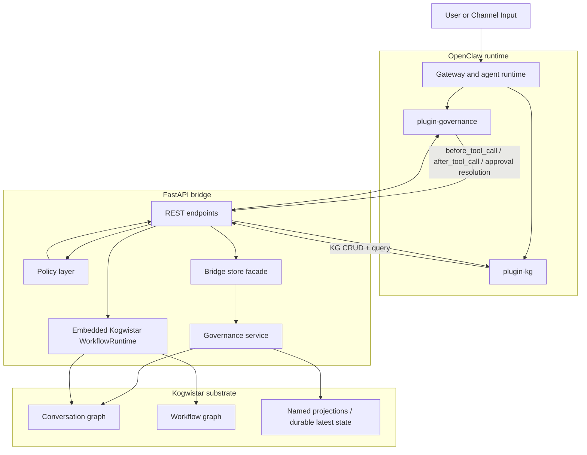
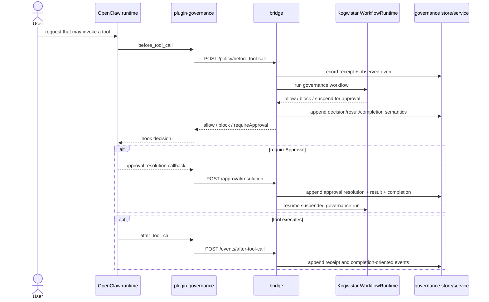

# OpenClaw × Kogwistar Architecture

## Summary

This repo connects OpenClaw to Kogwistar through:

- `plugin-governance/` for tool-call governance hooks
- `plugin-kg/` for Knowledge Graph CRUD tools
- a FastAPI bridge in `bridge/`
- an embedded Kogwistar workflow runtime, graph layer, and durable governance store/service

OpenClaw remains the execution runtime. The bridge is the governance and graph boundary.

## Current Topology

## Responsibility Split

### OpenClaw

- owns agent execution and tool execution
- emits `before_tool_call` and `after_tool_call`
- surfaces approval UX and Gateway approval events
- loads the two local plugins as normal OpenClaw extensions

### `plugin-governance`

- packages hook payloads for the bridge
- turns bridge decisions into OpenClaw-native `allow`, `block`, and `requireApproval`
- emits approval resolution payloads back to the bridge

### `plugin-kg`

- exposes bridge-backed graph CRUD and query as OpenClaw tools and CLI commands
- does not participate in governance decisions

### Bridge

- canonicalizes OpenClaw payloads into governance events and receipts
- appends durable governance state through the store/service layer
- hosts the governance workflow runtime and approval suspend/resume
- exposes `/kg/*` endpoints against the embedded conversation graph

### Kogwistar substrate

- stores workflow design and workflow execution trace
- stores semantic governance graph state in the conversation graph
- stores rebuildable latest-state projections through the named-projection/meta layer

## Runtime Flow

## Important Design Points

- OpenClaw is treated as an external runtime boundary. The bridge integrates through documented hooks, Gateway events, and operator APIs.
- Governance semantics live in canonical events, receipts, backbone steps, and semantic graph links, not just in the latest-state projection.
- Kogwistar is the current substrate choice. The bridge semantics are intended to remain portable even if the workflow/graph runtime is swapped later.
- The bridge is already using durable graph/projection infrastructure. The remaining refinement work is around ergonomics, inspection surfaces, and substrate-specific runtime trace details, not around whether durable governance state exists.

## Main Files

- Bridge entrypoint:
  - [bridge/app/main.py](/home/azureuser/cloistar/bridge/app/main.py)
- Bridge store facade:
  - [bridge/app/store.py](/home/azureuser/cloistar/bridge/app/store.py)
- Durable governance service:
  - [bridge/app/runtime/governance_service.py](/home/azureuser/cloistar/bridge/app/runtime/governance_service.py)
- Governance workflow design:
  - [bridge/app/runtime/governance_design.py](/home/azureuser/cloistar/bridge/app/runtime/governance_design.py)
- Governance workflow resolvers:
  - [bridge/app/runtime/governance_resolvers.py](/home/azureuser/cloistar/bridge/app/runtime/governance_resolvers.py)
- Governance plugin:
  - [plugin-governance/src/index.ts](/home/azureuser/cloistar/plugin-governance/src/index.ts)
- KG plugin:
  - [plugin-kg/src/index.ts](/home/azureuser/cloistar/plugin-kg/src/index.ts)
- Future UX direction:
  - [UX-proposal.md](/home/azureuser/cloistar/UX-proposal.md)
