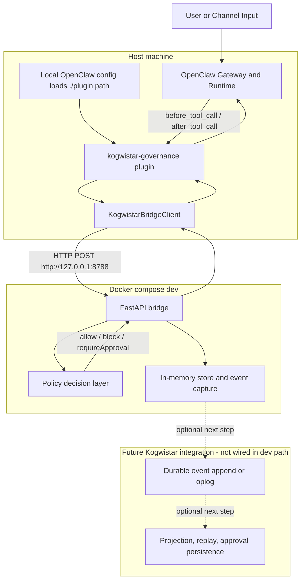
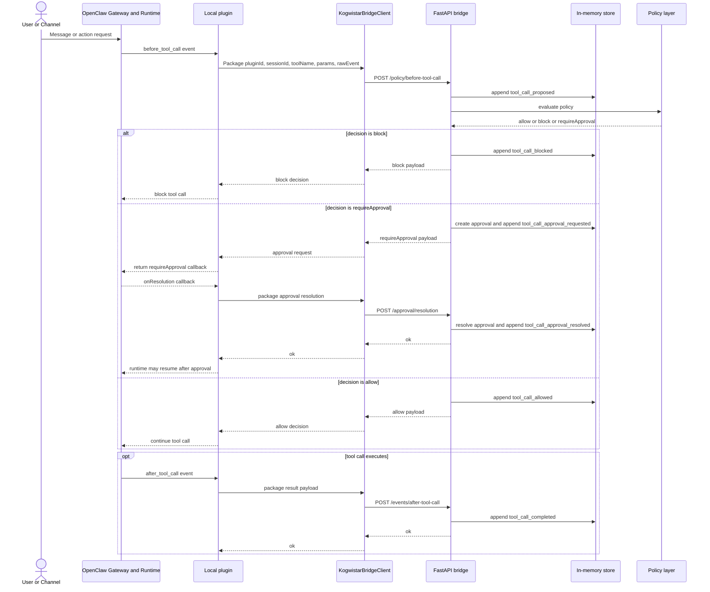

# OpenClaw × Kogwistar Dev Architecture

## Summary
This scaffold's current development topology is intentionally simple:

- OpenClaw runs on the host
- the `kogwistar-governance` plugin is built locally and loaded from the local `plugin/` path
- the FastAPI bridge is the only service started by `docker-compose.dev.yml`
- durable Kogwistar storage, projections, and replay layers are future integration targets, not active dev-path components yet

The key integration seam in development is the local OpenClaw plugin. OpenClaw does not talk directly to a Kogwistar backend in dev; it emits hook events, and the plugin translates those into HTTP requests to the bridge.

## Key Differences
| Aspect | OpenClaw in dev | Kogwistar in dev |
|--------|------------------|------------------|
| Role | Host-side execution harness and hook host | External governance bridge, policy decision point, and placeholder event sink |
| Where it runs | On the host | Bridge in Docker; durable event log, graph projection, and replay layers not yet wired |
| State | Runtime/session state managed by OpenClaw | In-memory event capture and approval records today; durable history planned |
| Integration seam | Emits `before_tool_call` and `after_tool_call` hook events | Receives hook payloads and returns `allow`, `block`, or `requireApproval` |
| Authority | Executes or aborts tool calls based on hook return values | Decides policy outcome, but does not execute tools directly |
| Replay | Not the focus of this scaffold | Intended future capability once real Kogwistar event sourcing is connected |
## Dev Topology
`docker-compose.dev.yml` starts only `bridge`. OpenClaw Gateway is started separately on the host, and it loads the local plugin via the filesystem path configured in `configs/openclaw/openclaw.json5`. The hardened/containerized OpenClaw flow is separate and is not the primary dev architecture shown below.

## Integration Mapping
- `before_tool_call` inside the plugin calls `POST /policy/before-tool-call`
- `after_tool_call` inside the plugin calls `POST /events/after-tool-call`
- approval callbacks call `POST /approval/resolution`
- the bridge returns one of `allow`, `block`, or `requireApproval`
- `GET /healthz` exists for operations and container health, not the main governance flow

## Runtime Flow

## Responsibilities In Dev
### OpenClaw on the host
- receives user and channel input
- runs the agent loop and tool execution
- emits `before_tool_call` and `after_tool_call`
- loads the local plugin from the configured filesystem path

### Local plugin on the host
- acts as the integration seam between OpenClaw hooks and the bridge
- translates hook events into bridge HTTP payloads
- converts bridge decisions into OpenClaw-native block or approval responses

### Bridge container
- exposes governance endpoints over HTTP
- records proposed, allowed, blocked, completed, and approval events in the in-memory store
- evaluates simple policy decisions

### Future Kogwistar backend
- would replace or extend the in-memory store with durable append, projections, and replay
- is not directly wired into the current dev scaffold

## Final Model
In development, OpenClaw is the host-side execution engine and the local plugin is the governance adapter. The bridge is the current policy and event boundary. Durable Kogwistar memory, projection, and replay remain the next integration layer rather than the active dev-path implementation.
